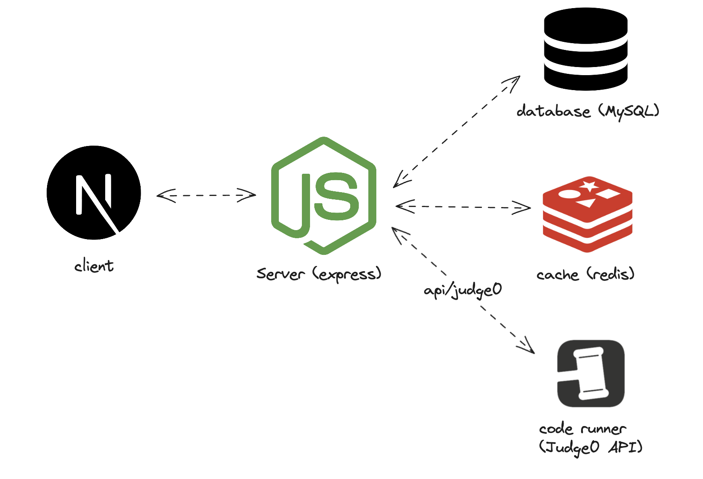

# Snippet Party

      

1. [About](#about)
2. [Architecture](#architecture)
3. [Setup](#setup)

## About

This project is to satisfy the following requirements for an [assignment]():

"Create a web application that facilitates the submission and display of code snippets. The application should consist of two pages:

Page 1: Construct a form to gather the following fields: username, preferred code language (C++, Java, JavaScript, Python), standard input (stdin), and the source code.

Page 2: Present all submitted entries in a tabular format, showcasing the username, code language, stdin, and the timestamp of submission. Additionally, limit the display of the source code to the initial 100 characters.

The application must function seamlessly with data stored in MySQL tables. Both the frontend and backend applications need to be hosted.

It is required to provide the source codes uploaded to a publicly accessible git repository, along with links to the hosted frontend and backend applications."

## Architecture



## Setup

To install the frontend:

```bash
cd web
pnpm install
pnpm run dev
```

To install the backend:

```bash
cd api
pnpm install
pnpm run dev
```

Make sure you fill out the `.env` files in both the `web` and `api` directories.
